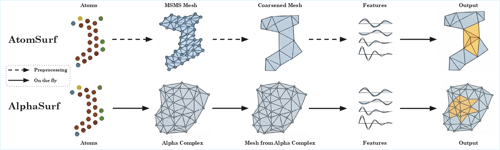

# AlphaSurf

Official implementation of AlphaSurf, extending [AtomSurf](https://arxiv.org/abs/2309.16519) with on-the-fly alpha complex surface generation.

## Table of Contents

- [Description](#description)
- [Installation](#installation)
  - [Environment setup](#environment-setup)
  - [CGAL alpha complex bindings](#cgal-alpha-complex-bindings)
- [On-the-fly training (MasifLigand)](#on-the-fly-training-masifligand)
  - [Overview](#overview)
  - [Quick start](#quick-start)
  - [Parameters](#parameters)
  - [Full example](#full-example)

## Description

AlphaSurf is a protein structure encoder that jointly encodes graphs and surfaces, with on-the-fly alpha complex surface generation during training.



## Installation

### Environment setup

#### Use within a container

For convenience, a definition file to be used with Singularity/Apptainer is provided in `atomsurf.def`.
You need to build the image first, and then freely use it:
```bash
apptainer build --fakeroot atomsurf.sif atomsurf.def
apptainer run atomsurf.sif <your-command>
```
#### Direct installation (no container)

The first thing you will need is an environment.

```bash
conda create -n atomsurf -y
conda activate atomsurf
conda install python=3.8
```

Now let's install the torch/pyg dependencies !

For GPU support, we recommend using conda:

```bash
conda install cudatoolkit=11.7 -c nvidia
conda install pytorch=1.13 pytorch-cuda=11.7 -c pytorch -c nvidia
conda install pyg=2.3.0 pytorch-scatter pytorch-sparse pytorch-spline-conv pytorch-cluster -c pyg
pip install pyg-lib==0.4.0 -f https://data.pyg.org/whl/torch-1.13.0+cu117.html
python -c "import torch; print(torch.cuda.is_available())"
# This should return True
```

Otherwise (for cpu install), pip is simpler. Using the --no-cache-dir can help avoid installation problems:

```bash
pip install --no-cache-dir torch==1.13.1+cpu --extra-index-url https://download.pytorch.org/whl/cpu
pip install --no-cache-dir torch_scatter torch_sparse torch_spline_conv torch_cluster pyg_lib -f https://data.pyg.org/whl/torch-1.13.1+cpu.html
pip install --no-cache-dir torch_geometric==2.3.0 -f https://data.pyg.org/whl/torch-1.13.1+cpu.html
```

Finally, let's install other dependencies, in particular diffusion-net:

```bash
pip install git+https://github.com/pvnieo/diffusion-net-plus.git
pip install -r requirements.txt
```

### CGAL alpha complex bindings

On-the-fly surface generation with the `alpha_complex` method requires CGAL Python bindings. These are located in `cgal_alpha_bindings/`.

#### Dependencies

- CGAL 5.x+
- GMP, MPFR
- pybind11
- Python 3.8+
- CMake 3.16+

#### Build

**Linux (Ubuntu/Debian)**

```bash
sudo apt install libcgal-dev libgmp-dev libmpfr-dev python3-dev cmake
pip install pybind11

cd cgal_alpha_bindings
mkdir build && cd build
cmake ..
make -j$(nproc)
```

**macOS (Homebrew)**

```bash
brew install cgal gmp mpfr
pip install pybind11

cd cgal_alpha_bindings
mkdir build && cd build
cmake ..
make -j$(sysctl -n hw.ncpu)
```

**Conda**

```bash
conda install -c conda-forge cgal-cpp pybind11

cd cgal_alpha_bindings
mkdir build && cd build
cmake ..
make -j8
```

#### Making the bindings available

The code auto-detects the bindings relative to the source tree. If you need to override the path (e.g. in SLURM jobs with multiprocessing workers), set:

```bash
export CGAL_BINDINGS_DIR=/path/to/cgal_alpha_bindings/build
export PYTHONPATH="$CGAL_BINDINGS_DIR:$PYTHONPATH"
```

## On-the-fly training (MasifLigand)

### Overview

Instead of preprocessing surfaces to disk, on-the-fly training generates surfaces and graphs during training. This enables training with different surface methods (`msms` or `alpha_complex`) without re-preprocessing.

The entry point is `train_on_fly.py` in `atomsurf/tasks/masif_ligand/` (as opposed to `train.py` for disk-based training).

### Quick start

From `atomsurf/tasks/masif_ligand/`:

```bash
python train_on_fly.py \
  data_dir=/path/to/masif_ligand \
  on_fly.surface_method=alpha_complex \
  on_fly.alpha_value=0 \
  on_fly.face_reduction_rate=1.0
```

Or submit via SLURM using the provided script:

```bash
sbatch train_onfly.sh
```

Environment variables can be used to override defaults in `train_onfly.sh`:

```bash
SURFACE_METHOD=alpha_complex ALPHA_VALUE=0 sbatch train_onfly.sh
```

### Parameters

All on-the-fly parameters live under the `on_fly` config group and can be overridden on the command line via Hydra.

#### Surface generation

| Parameter | Default | Description |
|---|---|---|
| `on_fly.surface_method` | `msms` | Surface method: `msms` or `alpha_complex` |
| `on_fly.alpha_value` | `0.1` | Alpha value for alpha complex (0 = tightest fit) |
| `on_fly.face_reduction_rate` | `0.1` | Mesh simplification rate (1.0 = no reduction) |
| `on_fly.max_vert_number` | `10000000` | Maximum vertices per surface |
| `on_fly.use_pymesh` | `false` | Use PyMesh for mesh cleaning |

#### Patch extraction

| Parameter | Default | Description |
|---|---|---|
| `on_fly.use_whole_surfaces` | `false` | If `true`, use full protein surfaces. If `false`, extract patches around binding sites |
| `on_fly.patch_radius` | `6.0` | Distance threshold (angstroms) for including vertices in a patch |
| `on_fly.precomputed_patches_dir` | `null` | Path to precomputed MSMS patches (optional, speeds up `msms` mode) |

#### ESM embeddings

| Parameter | Default | Description |
|---|---|---|
| `on_fly.esm_dir` | `null` | Directory containing precomputed `{name}_esm.pt` files. If `null`, ESM is computed on-the-fly |

### Full example

```bash
python train_on_fly.py \
  data_dir=/path/to/masif_ligand \
  on_fly.surface_method=alpha_complex \
  on_fly.alpha_value=0 \
  on_fly.face_reduction_rate=1.0 \
  on_fly.use_whole_surfaces=False \
  on_fly.patch_radius=8.0 \
  on_fly.esm_dir=/path/to/masif_ligand/esm \
  on_fly.noise_mode=none \
  cfg_surface.use_whole_surfaces=False \
  cfg_graph.use_graphs=True \
  cfg_graph.use_esm=True \
  encoder=pronet_gvpencoder.yaml \
  optimizer.lr=0.0001 \
  scheduler=reduce_lr_on_plateau \
  epochs=500 \
  loader.batch_size=4 \
  loader.num_workers=8 \
  loader.pin_memory=false \
  loader.persistent_workers=true \
  device=0
```
