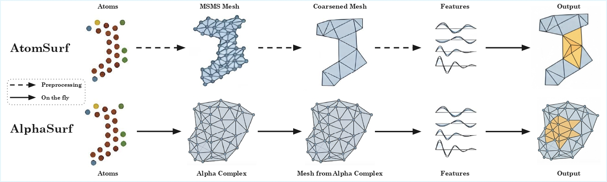

# AlphaSurf

Official implementation of AlphaSurf, extending [AtomSurf](https://arxiv.org/abs/2309.16519) with on-the-fly alpha complex surface generation.

## Table of Contents

- [Description](#description)
- [Installation](#installation)
  - [Environment setup](#environment-setup)
  - [CGAL alpha complex bindings](#cgal-alpha-complex-bindings)
- [Inference](#inference)
- [Tasks](#tasks)
  - [MasifLigand](#masifligand)
  - [PINDER-Pair](#pinder-pair)

## Description

AlphaSurf is a protein structure encoder that jointly encodes graphs and surfaces, with on-the-fly alpha complex surface generation during training.



## Installation

### Environment setup

```bash
conda create -n alphasurf python=3.10 -y
conda activate alphasurf
```

Install PyTorch and PyG (CUDA 11.8):

```bash
pip install torch==2.4.1+cu118 torchvision==0.19.1+cu118 torchaudio==2.4.1+cu118 --index-url https://download.pytorch.org/whl/cu118
pip install torch_geometric==2.6.1
pip install torch_scatter torch_sparse torch_spline_conv torch_cluster -f https://data.pyg.org/whl/torch-2.4.1+cu118.html
pip install pyg-lib==0.4.0 -f https://data.pyg.org/whl/torch-2.4.1+cu118.html
```

Install the remaining dependencies:

```bash
pip install git+https://github.com/pvnieo/diffusion-net-plus.git
pip install -r requirements.txt
```

### CGAL alpha complex bindings

On-the-fly surface generation requires CGAL Python bindings. These are located in `cgal_alpha_bindings/`.

#### Dependencies

- CGAL 5.x+
- GMP, MPFR
- pybind11
- Python 3.10+
- CMake 3.16+

#### Build

**Linux (Ubuntu/Debian)**

```bash
sudo apt install libcgal-dev libgmp-dev libmpfr-dev python3-dev cmake
pip install pybind11

cd cgal_alpha_bindings
mkdir build && cd build
cmake ..
make cgal_alpha_algo2 -j$(nproc)
```

**macOS (Homebrew)**

```bash
brew install cgal gmp mpfr
pip install pybind11

cd cgal_alpha_bindings
mkdir build && cd build
cmake ..
make cgal_alpha_algo2 -j$(sysctl -n hw.ncpu)
```

**Conda**

```bash
conda install -c conda-forge cgal-cpp pybind11

cd cgal_alpha_bindings
mkdir build && cd build
cmake ..
make cgal_alpha_algo2 -j8
```

#### Making the bindings available

After building, the compiled `.so` file lands in `cgal_alpha_bindings/build/`. When you import `cgal_alpha` in Python, it needs to find that `.so` on `sys.path`. The code does this automatically by looking for `cgal_alpha_bindings/build/` relative to the source tree.

This works out of the box when running from the repo. However, some environments override the working directory or `sys.path` — for example SLURM jobs with `multiprocessing` workers using the `spawn` or `forkserver` start method. In that case each worker process starts fresh and may not inherit the path setup. To handle this, set the environment variable before launching your job:

```bash
export CGAL_BINDINGS_DIR=/path/to/cgal_alpha_bindings/build
export PYTHONPATH="$CGAL_BINDINGS_DIR:$PYTHONPATH"
```

### Curvature extension

The `cpp_curvature` module provides a C++ extension for computing principal curvatures on surface meshes. It also needs to be compiled after setting up the environment:

```bash
cd cpp_curvature
python build.py
```

This requires `pybind11` and `eigen` headers (both already available if you installed the CGAL bindings above).

### Compatibility symlink

The provided checkpoint references `atomsurf.*` import paths. Create a symlink so both names resolve:

```bash
cd alphasurf
ln -s alphasurf atomsurf
```

## Inference

Embed a trained model's encoder on a single protein to get per-residue graph embeddings and per-vertex surface embeddings.

**Location:** `alphasurf/tasks/inference/`

A trained checkpoint is available at `alphasurf/tasks/pinder_pair/ckpt/last.ckpt`. This model was trained on the PINDER dataset for classifying residue pairs as interacting or not.

```bash
cd alphasurf/tasks/inference

python embed.py --ckpt ../pinder_pair/ckpt/last.ckpt --pdb protein.pdb
```

Output is a `.pt` file containing `graph_embedding` (N_residues x D), `surface_embedding` (N_verts x D), `graph_node_pos`, and `surface_verts`.

## Tasks

### MasifLigand

Prediction of ligand binding sites on protein surfaces. Given a protein structure, the model classifies surface patches by ligand type (7 classes).

**Location:** `alphasurf/tasks/masif_ligand_new/`

Supports both on-the-fly and disk-based training. On-the-fly mode generates surfaces and graphs during training, allowing experimentation with different surface methods without re-preprocessing.

```bash
cd alphasurf/tasks/masif_ligand_new

# On-the-fly training with alpha complex surfaces
python train.py \
  data_dir=/path/to/masif_ligand \
  on_fly.surface_method=alpha_complex \
  on_fly.alpha_value=0 \
  on_fly.face_reduction_rate=1.0

# Or via SLURM
sbatch train.sh
```

### PINDER-Pair

Protein-protein interaction prediction on the [PINDER](https://pinder.org/) dataset. Given a receptor and ligand protein, the model predicts per-residue interaction probabilities (which residue pairs form the interface) and per-residue binding site scores.

**Location:** `alphasurf/tasks/pinder_pair/`

Supports both on-the-fly and disk-based training. On-the-fly mode generates surfaces and graphs during training. Three test settings are available: holo (bound structures), apo (unbound experimental), and af2 (AlphaFold2 predicted).

```bash
cd alphasurf/tasks/pinder_pair

# On-the-fly training
python train.py \
  data_dir=/path/to/pinder \
  on_fly.surface_method=alpha_complex \
  on_fly.face_reduction_rate=1.0 \
  on_fly.use_whole_surfaces=True \
  cfg_surface.use_whole_surfaces=True \
  cfg_graph.use_graphs=True \
  cfg_graph.use_esm=False \
  encoder=pronet_gvpencoder.yaml \
  optimizer.lr=0.0001 \
  scheduler=reduce_lr_on_plateau \
  epochs=500 \
  loader.batch_size=4 \
  loader.num_workers=8 \
  loader.pin_memory=false \
  loader.persistent_workers=true

# Disk-based training (requires precompute.py first)
python precompute.py data_dir=/path/to/pinder
python train.py data_dir=/path/to/pinder on_fly=null
```
