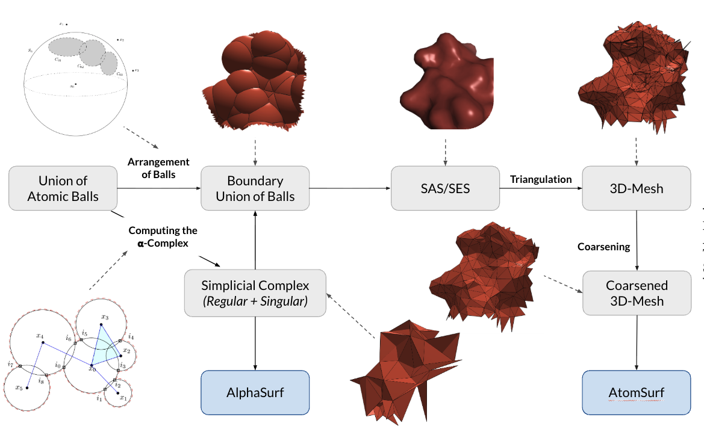

# AlphaSurf

[](https://openreview.net/pdf?id=rBjKl58v54)


Official implementation of AlphaSurf (published at the [LMRL workshop, ICLR 2026](https://openreview.net/pdf?id=rBjKl58v54)), extending [AtomSurf](https://arxiv.org/abs/2309.16519) with on-the-fly alpha complex surface generation.
## Table of Contents

- [Description](#description)
- [Installation](#installation)
    - [Environment setup](#environment-setup)
    - [CGAL alpha complex bindings](#cgal-alpha-complex-bindings)
- [Inference](#inference)
- [Tasks](#tasks)
    - [MasifLigand](#masifligand)
    - [PINDER-Pair](#pinder-pair)
    - [MISATO binding-site prediction](#misato-binding-site-prediction)

## Description

AlphaSurf is a protein structure encoder that jointly encodes graphs and surfaces, with on-the-fly alpha complex surface generation during training.



## Installation

### Environment setup

```bash
conda create -n alphasurf python=3.10 -y
conda activate alphasurf
```

Install PyTorch and PyG (CUDA 11.8):

```bash
pip install torch==2.4.1+cu118 torchvision==0.19.1+cu118 torchaudio==2.4.1+cu118 --index-url https://download.pytorch.org/whl/cu118
pip install torch_geometric==2.6.1
pip install torch_scatter torch_sparse torch_spline_conv torch_cluster -f https://data.pyg.org/whl/torch-2.4.1+cu118.html
pip install pyg-lib==0.4.0 -f https://data.pyg.org/whl/torch-2.4.1+cu118.html
```

Install the remaining dependencies:

```bash
pip install git+https://github.com/pvnieo/diffusion-net-plus.git
pip install -r requirements.txt
```

### CGAL alpha complex bindings

On-the-fly surface generation requires CGAL Python bindings. These are located in `cgal_alpha_bindings/`.

#### Dependencies

- CGAL 5.x+
- GMP, MPFR
- pybind11
- Python 3.10+
- CMake 3.16+

#### Build

**Linux (Ubuntu/Debian)**

```bash
sudo apt install libcgal-dev libgmp-dev libmpfr-dev python3-dev cmake
pip install pybind11

cd cgal_alpha_bindings
mkdir build && cd build
cmake ..
make cgal_alpha_algo2 -j$(nproc)
```

**macOS (Homebrew)**

```bash
brew install cgal gmp mpfr
pip install pybind11

cd cgal_alpha_bindings
mkdir build && cd build
cmake ..
make cgal_alpha_algo2 -j$(sysctl -n hw.ncpu)
```

**Conda**

```bash
conda install -c conda-forge cgal-cpp pybind11

cd cgal_alpha_bindings
mkdir build && cd build
cmake ..
make cgal_alpha_algo2 -j8
```

#### Making the bindings available

After building, the compiled `.so` file lands in `cgal_alpha_bindings/build/`. When you import `cgal_alpha` in Python, it needs to find that `.so` on `sys.path`. The code does this automatically by looking for `cgal_alpha_bindings/build/` relative to the source tree.

This works out of the box when running from the repo. However, some environments override the working directory or `sys.path` — for example SLURM jobs with `multiprocessing` workers using the `spawn` or `forkserver` start method. In that case each worker process starts fresh and may not inherit the path setup. To handle this, set the environment variable before launching your job:

```bash
export CGAL_BINDINGS_DIR=/path/to/cgal_alpha_bindings/build
export PYTHONPATH="$CGAL_BINDINGS_DIR:$PYTHONPATH"
```

### Curvature extension

The `cpp_curvature` module computes principal curvatures on alpha complex surfaces. It is exactly the same as `igl.per_vertex_normals` but takes custom vertex normals as input (computed by the alpha complex pipeline). It is required for using alpha complex surfaces.

```bash
cd cpp_curvature
python build.py
```

The `eigen` headers are already available from the `cgal-cpp` conda install, and `pybind11` was installed earlier.

## Inference

Embed a trained model's encoder on a single protein to get per-residue graph embeddings and per-vertex surface embeddings.

**Location:** `alphasurf/tasks/inference/`

A trained checkpoint is available at `alphasurf/tasks/pinder_pair/ckpt/last.ckpt`. This model was trained on the PINDER dataset for classifying residue pairs as interacting or not.

The provided checkpoint references `atomsurf.*` import paths. A symlink `atomsurf -> alphasurf` is included in the repo. If it was not restored (e.g. on Windows), recreate it from the repo root:

```bash
ln -s alphasurf atomsurf
```

Then run:

```bash
cd alphasurf/tasks/inference

python embed.py --ckpt ../pinder_pair/ckpt/last.ckpt --pdb protein.pdb
```

Output is a `.pt` file containing `graph_embedding` (N_residues x D), `surface_embedding` (N_verts x D), `graph_node_pos`, and `surface_verts`.

## Tasks

### MasifLigand

Prediction of ligand binding sites on protein surfaces. Given a protein structure, the model classifies surface patches by ligand type (7 classes).

**Location:** `alphasurf/tasks/masif_ligand_new/`

Supports both on-the-fly and disk-based training. On-the-fly mode generates surfaces and graphs during training, allowing experimentation with different surface methods without re-preprocessing.

```bash
cd alphasurf/tasks/masif_ligand_new

# On-the-fly training with alpha complex surfaces
python train.py \
  data_dir=/path/to/masif_ligand \
  on_fly.surface_method=alpha_complex \
  on_fly.alpha_value=0 \
  on_fly.face_reduction_rate=1.0

# Or via SLURM
sbatch train.sh
```

### PINDER-Pair

Protein-protein interaction prediction on the [PINDER](https://pinder.org/) dataset. Given a receptor and ligand protein, the model predicts per-residue interaction probabilities (which residue pairs form the interface) and per-residue binding site scores.

**Location:** `alphasurf/tasks/pinder_pair/`

Supports both on-the-fly and disk-based training. On-the-fly mode generates surfaces and graphs during training. Three test settings are available: holo (bound structures), apo (unbound experimental), and af2 (AlphaFold2 predicted).

```bash
cd alphasurf/tasks/pinder_pair

# On-the-fly training
python train.py \
  data_dir=/path/to/pinder \
  on_fly.surface_method=alpha_complex \
  on_fly.face_reduction_rate=1.0 \
  on_fly.use_whole_surfaces=True \
  cfg_surface.use_whole_surfaces=True \
  cfg_graph.use_graphs=True \
  cfg_graph.use_esm=False \
  encoder=pronet_gvpencoder.yaml \
  optimizer.lr=0.0001 \
  scheduler=reduce_lr_on_plateau \
  epochs=500 \
  loader.batch_size=4 \
  loader.num_workers=8 \
  loader.pin_memory=false \
  loader.persistent_workers=true

# Disk-based training (requires precompute.py first)
python precompute.py data_dir=/path/to/pinder
python train.py data_dir=/path/to/pinder on_fly=null
```

#### Noise augmentation

PINDER-Pair supports `joint_mesh` train-time augmentation when surfaces are generated on the fly. It first adds Gaussian noise to the atom coordinates used by both the residue graph and surface generator, then independently displaces the resulting surface vertices along their normals. Validation and testing always use clean structures. Set `noise_mode=none` to disable augmentation.

Train with `joint_mesh` noise:

```bash
cd alphasurf/tasks/pinder_pair

python train.py \
  data_dir=/path/to/pinder \
  on_fly.surface_method=alpha_complex \
  on_fly.noise_mode=joint_mesh \
  on_fly.sigma_graph=0.3 \
  on_fly.sigma_mesh=0.3 \
  on_fly.clip_sigma=3.0
```

A trained checkpoint can be evaluated on all three clean structural settings with:

```bash
python test.py \
  data_dir=/path/to/pinder \
  ckpt_path=/path/to/model.ckpt \
  test_setting=all
```

### MISATO binding-site prediction

Residue-level ligand binding-site prediction on the [MISATO](https://zenodo.org/records/7711953) molecular-dynamics dataset. The ligand is used only to construct fixed binary labels: a residue is positive when its C-alpha atom is within 10 Å of a ligand heavy atom in trajectory frame 0. The model receives only the protein graph and alpha-complex surface.

The official sequence-clustered train, validation, and test splits are applied at the complex level. Training samples a random trajectory frame, while validation and testing use frame 0.

**Location:** `alphasurf/tasks/misato_binding_site/`

Download the MISATO trajectory file and official splits. The preprocessing command then reads frame 0 and writes `binding_site/<pdb_id>.pt` files containing the protein atom metadata, residue indices, and fixed binding-site labels required for training:

```bash
bash alphasurf/tasks/misato_binding_site/download_misato.sh /path/to/misato

python -m alphasurf.tasks.misato_binding_site.preprocess \
  --data-dir /path/to/misato
```

`MD.hdf5` is approximately 133 GB. The trajectory coordinates remain in that file; training reads one frame per complex lazily instead of copying trajectories into the preprocessed cache.

Train with random MD frames and evaluate on frame 0:

```bash
python -m alphasurf.tasks.misato_binding_site.train \
  data_dir=/path/to/misato \
  train_frame_mode=random \
  eval_frame_mode=first
```

See the [MISATO task README](alphasurf/tasks/misato_binding_site/README.md) for the SLURM launchers and additional evaluation utilities.
